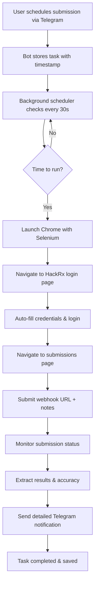

# 🚀Endpoint Submission Automation Bot

<div align="center">


**Never miss another submission deadline again!**

*Automate your  endpoint submissions with intelligent scheduling and real-time monitoring*

</div>

## 🎯 The Problem

During hackathons, competitions, endpoint submissions often occur at **random times** - sometimes at 2 AM or other inconvenient hours. Missing these submissions means losing your chance to compete, but staying awake all night isn't practical.

**This bot solves that problem completely.**

## ✨ What It Does

The  Automation Bot is your personal submission assistant that:

- 🕐 **Schedules submissions** for any future time
- 🔐 **Automatically logs in** to HackRx using Selenium
- 🌐 **Submits your webhook URL** with custom notes
- 📊 **Monitors results** and extracts accuracy scores
- 📱 **Sends real-time notifications** via Telegram
- 💾 **Persists tasks** across bot restarts
- 🚫 **Handles cooldowns** and error states gracefully

## 🔄 How It Works

### The Complete Flow



### Step-by-Step Process

1. **📅 Scheduling Phase**
   - User sends time (e.g., "Tomorrow 2:15 PM", "8:30 AM")
   - Bot parses flexible time formats
   - User provides webhook URL (or uses default)
   - User adds submission notes/description
   - Task saved to JSON file with persistence

2. **🤖 Automation Phase**
   - Background scheduler detects it's time to run
   - Selenium launches headless Chrome browser
   - Bot navigates to HackRx platform
   - Auto-login with stored credentials
   - Submits webhook URL with notes

3. **📊 Monitoring Phase**
   - Continuously monitors submission status
   - Detects cooldown periods vs actual results
   - Extracts accuracy scores and response times
   - Handles errors and timeouts gracefully

4. **📱 Notification Phase**
   - Real-time updates sent to Telegram
   - Detailed results with accuracy metrics
   - Error notifications if something goes wrong
   - Cooldown notifications for pending results

## 🛠️ Tech Stack

<div align="center">

### Core Technologies

| Technology | Purpose | Version |
|------------|---------|---------|
|  | **Core Runtime** | 3.8+ |
|  | **User Interface** | python-telegram-bot |
|  | **Web Automation** | WebDriver |
|  | **Browser Engine** | ChromeDriver |

### Key Libraries

- **`python-telegram-bot`** - Telegram Bot API wrapper
- **`selenium`** - Web browser automation
- **`asyncio`** - Asynchronous programming support
- **`threading`** - Background task scheduling
- **`dataclasses`** - Type-safe data structures
- **`pytz`** - Timezone handling (IST support)
- **`json`** - Task persistence storage

</div>

## 🚀 Getting Started

### Prerequisites

```bash
# Install Python 3.8+
python --version

# Install Chrome browser
# Download from: https://www.google.com/chrome/

# Install ChromeDriver
# Download from: https://chromedriver.chromium.org/
```

### Installation

1. **Clone the repository**
   ```bash
   git clone <repository-url>
   cd hackrx-automation-bot
   ```

2. **Install dependencies**
   ```bash
   pip install -r requirements.txt
   ```

3. **Set up environment variables**
   ```bash
   export BOT_TOKEN="your_telegram_bot_token"
   export HACKRX_USERNAME="your_hackrx_username"
   export HACKRX_PASSWORD="your_hackrx_password"
   ```

4. **Create your Telegram bot**
   - Message [@BotFather](https://t.me/botfather) on Telegram
   - Create new bot with `/newbot`
   - Get your bot token

5. **Run the bot**
   ```bash
   python main.py
   ```

## 💬 Bot Commands

### Available Commands

| Command | Description | Usage |
|---------|-------------|-------|
| `/start` | Show welcome menu and options | `/start` |
| `/schedule` | Schedule a new submission | `/schedule` |
| `/mytasks` | View all your scheduled tasks | `/mytasks` |
| `/cancel` | Cancel a pending task | `/cancel` |

### Time Format Examples

The bot accepts flexible time formats:

```
✅ "8:15 PM"           - Today at 8:15 PM
✅ "Tomorrow 2:30 PM"   - Tomorrow at 2:30 PM  
✅ "20:15"              - Today at 8:15 PM (24h format)
✅ "2024-01-15 8:15 PM" - Specific date and time
```

## 📊 Features Deep Dive

### Intelligent Scheduling
- **Flexible time parsing** with natural language support
- **IST timezone** handling for Indian competitions
- **Future-only scheduling** prevents accidental past submissions
- **Persistent storage** survives bot restarts

### Robust Automation
- **Headless browser** operation for server deployment  
- **Error recovery** with retry mechanisms
- **Session management** with automatic login
- **Dynamic waiting** for page loads

### Smart Monitoring
- **Cooldown detection** for high-traffic periods
- **Result extraction** with accuracy parsing
- **Timeout handling** for long-running submissions
- **Status differentiation** (processing, completed, failed)

### Rich Notifications
```
🎉 Task Completed Successfully!

📝 Notes: API endpoint test run #1
🌐 Webhook: https://api.example.com/webhook

🎯 Results:
✅ Accuracy: 95.2%
⏱️ Response Time: 142ms  
🏆 Position: #3

🕐 Completed at: 2024-01-15 02:15 PM IST
```

## 🏗️ Architecture

### Class Structure

```python
├── HackRxBot                 # Main bot controller
│   ├── Command handlers      # /start, /schedule, etc.
│   ├── Message processing    # User input handling  
│   ├── State management      # User conversation flow
│   └── Task scheduling       # Background automation
│
├── TaskManager              # Task persistence
│   ├── JSON storage         # File-based database
│   ├── CRUD operations      # Task management
│   └── Status tracking      # Task lifecycle
│
├── ScheduledTask            # Data model
│   ├── User information     # Who scheduled it
│   ├── Execution details    # When and what to run
│   └── Results storage      # Outcome tracking
│
└── HackRxSeleniumScraper   # Web automation (external)
    ├── Browser control      # Selenium WebDriver
    ├── Login automation     # Credential handling
    └── Result monitoring    # Page scraping
```

### Threading Model

- **Main Thread**: Telegram bot polling and message handling
- **Scheduler Thread**: Background task checking every 30 seconds  
- **Execution Threads**: Individual task automation (one per task)
- **Notification Queue**: Async message delivery to users

## 🔧 Configuration

### Environment Variables

```bash
BOT_TOKEN=your_telegram_bot_token_here
HACKRX_USERNAME=your_hackrx_platform_username  
HACKRX_PASSWORD=your_hackrx_platform_password
```

### Default Settings

```python
DEFAULT_WEBHOOK_URL = "our endpint which we had to submit"
IST_TIMEZONE = "Asia/Kolkata" 
SCHEDULER_INTERVAL = 30  # seconds
MAX_MONITORING_TIME = 100  # minutes
```

## 🛡️ Error Handling

The bot handles various error scenarios:

- **🔐 Login failures** - Credential verification
- **🌐 Network issues** - Retry with exponential backoff  
- **⏰ Timeout scenarios** - Graceful degradation
- **❄️ Cooldown periods** - User notification with status
- **🚫 Invalid inputs** - User-friendly error messages
- **💥 Selenium crashes** - Automatic driver restart

## 🎮 Use Cases

### Perfect for:
- **🏆 Hackathon participants** who can't stay awake for random submission times
- **👥 Team competitions** where one person manages all submissions  
- **🔄 Repeated testing** of endpoints at specific intervals
- **📊 Performance monitoring** with automated result tracking
- **⏰ Time zone challenges** when competing from different regions

### Real-world scenarios:
```
"Submit our ML model endpoint at 2 AM when the dataset gets updated"
"Schedule 5 different webhook tests throughout the night"  
"Monitor our API performance during peak traffic hours"
"Ensure we don't miss the final submission window"
```

## 🚨 Security Considerations

- **Environment variables** for sensitive credentials
- **Headless operation** prevents screen recording attacks
- **Local storage only** - no cloud credential storage
- **Session cleanup** after each automation run
- **Input validation** prevents injection attacks

## 🤝 Contributing

We welcome contributions! Please see our [Contributing Guidelines](CONTRIBUTING.md) for details.

### Development Setup
```bash
# Clone and setup development environment
git clone <repo-url>
cd hackrx-automation-bot
pip install -r requirements-dev.txt
pre-commit install
```

## 📄 License

This project is licensed under the MIT License - see the [LICENSE](LICENSE) file for details.

## 🙏 Acknowledgments


- **Telegram Bot API** for excellent documentation  
- **Selenium Community** for robust automation tools
- **Python asyncio** for making concurrent programming possible

---

<div align="center">

**Built with ❤️ for the hackathon community**

*Never miss another submission deadline again!*

[](https://github.com/yourusername/hackrx-automation-bot)
[](https://twitter.com/yourhandle)

</div>
